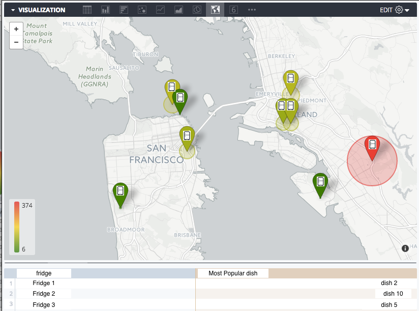

# Geographical trend solution overview

## Requirement

Support geographical trend analysis to hone Farmacy Family’s ability to optimize the foods delivered to fridges (an additional integration point TO Farmacy Foods)

## Solution

Farmacy family will optimize food through tracking which geographical areas favor which dishes. This is done via Looker dashboards populated with data from BigQuery. Farmacy Family can see what favorite dishes each area purchases and deliver a higher quantitiy of those dishes to each fridge.

From Looker you will be able to dig deeper into the data and start to see trends on which dishes are starting to rise and fall over time. This example shows fridges around the area and at a high level what the top dish at each is.

