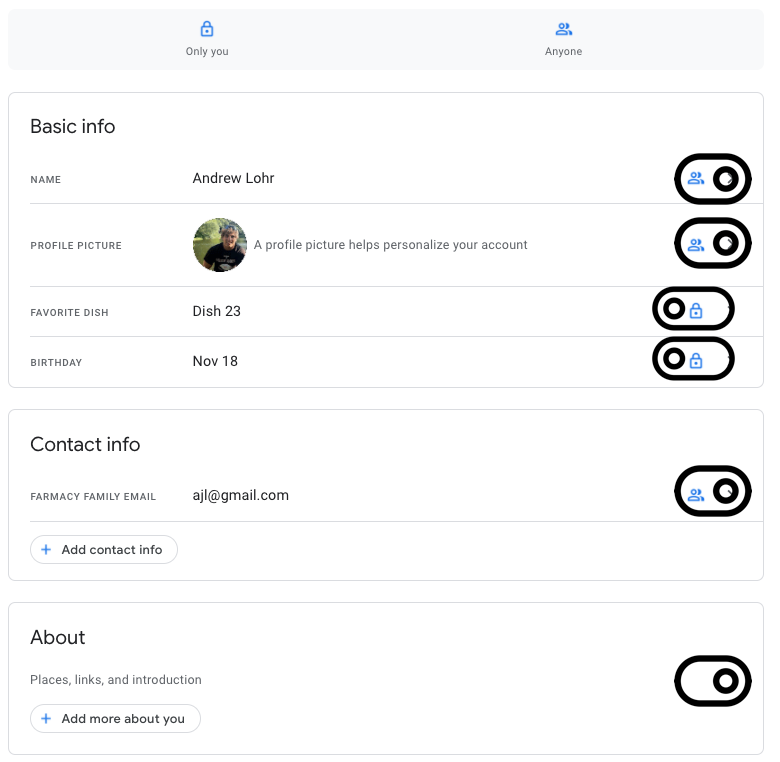

# Privacy solution overview

## Requirement

Farmacy Family customers can customize how much profile information they want to allow the community to see, at a fine-grained level.

## Solution

Through the Farmacy Family UI, registered users have a profile with various settings related to their account. There will be a setting for privacy related settings where users can toggle how much information they want the community to see. Togglable options are defaulted to off (do not show publicly) and will include:

* Full name
* Profile picture
* Favorite dish
    * This will be asked during registration and optional.
* Birthday
* Contact email
* About me information
    * This is a section in the profile the user can write about themselves.

When a user views another user's profile, only information marked as publicly available will be shown to other users. A privacy checkup reminder will be shown to the user every 6 months as a banner on the UI to remind them to view their profile and check what is publicly available. This will keep the users data updated since they will view their profile and update any incorrect info as well as boost their confidence that Farmacy Family cares about their personal data.

Example:

To implement the user roles that can view user's private data, the NCR Security Service is used. For example, by defining the role of CLINIC_EMPLOYEE, workers at the clinic can see health needs of users without exposing them to the public.